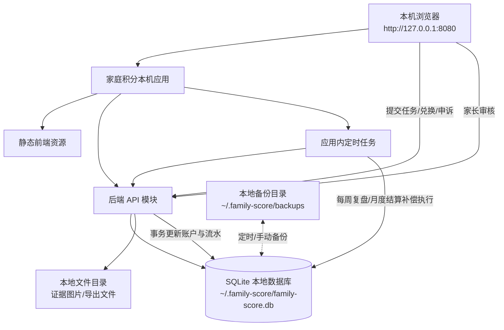

# 家庭德育积分系统技术实现方案

## 一、项目背景

基于 `design.md` 中的家庭德育积分制度，需要建设一套面向家庭场景的轻量级积分管理系统，用于记录 8-10 岁独生男孩在学习、自理、家务、情绪、健康、安全等方面的日常行为，并通过 `100 分基准德育分 + 超额兑换分 + 星星 + 家庭小队分` 的账户模型，形成可记录、可复盘、可兑换、可修复的闭环。

当前制度如果只靠纸面或口头执行，容易出现以下问题：

- 家长记录不连续，孩子对规则缺少稳定预期。
- 加分、扣分、修复、兑换缺少统一明细，复盘时容易争议。
- 超额兑换分、基准分、星星、家庭小队分容易混用。
- 周结、月结、申诉次数、兑换限制等规则人工执行成本高。
- 孩子无法直观看到自己的进步趋势和长期目标。

本项目通过系统化实现，将规则落到任务、账户、明细、兑换、申诉、结算、看板等模块中，降低家长执行成本，并保证规则稳定、透明、可追溯。

## 二、项目目标

### 2.1 业务目标

1. 支持家长按日记录孩子的加分、扣分、修复任务和兑换申请。
2. 支持 `基准德育分`、`超额兑换分`、`星星`、`家庭小队分` 四类账户独立管理。
3. 支持基于分数状态自动识别绿色、蓝色、黄色、橙色、红色等状态等级。
4. 支持任务模板、每日任务、每周任务、修复任务、家庭小队任务配置。
5. 支持孩子查看积分、任务、奖励和申诉记录，形成正向反馈。
6. 支持每周复盘、每月结算、超额分转星星、家庭小队评级。
7. 支持兑换限制，避免不适合 8-10 岁儿童的奖励被配置或兑换。

### 2.2 技术目标

1. 系统单独部署在个人电脑本机，不依赖公网服务器和云数据库。
2. 采用单体应用实现，前端静态资源、后端 API、定时任务、SQLite 数据库由同一应用包承载。
3. 默认仅监听 `127.0.0.1`，通过浏览器访问本机地址，避免家庭数据暴露到局域网或公网。
4. 账户变更必须通过明细流水驱动，保证可追溯。
5. 核心积分变更使用 SQLite 事务保证一致性。
6. 数据库操作优先使用 SQL 方式实现，避免复杂 ORM 链式逻辑隐藏业务规则。
7. 支持本地数据备份、恢复和导出，避免个人电脑损坏或误删导致数据丢失。
8. 支持后续扩展为局域网访问、多孩子、多家庭成员、多设备使用，但第一阶段不作为强依赖。
9. 支持应用内定时任务完成周统计、月结算和过期兑换分处理。

## 三、需求地址

待确认

本次输入材料：`/Users/jryg/score/openspec/design.md`

## 四、飞书项目地址

待确认

## 五、关联项目

- 需求/PRD：`/Users/jryg/score/openspec/design.md`
- 相关项目/仓库：待确认
- API 文档地址：待确认
- 原型地址：待确认
- 部署环境：个人电脑本机单独部署，默认访问地址 `http://127.0.0.1:8080`
- 数据库选型：`SQLite` 本地文件数据库
- 数据目录：建议默认使用用户目录下的应用数据目录，如 `~/.family-score/`
- 备份目录：建议默认使用 `~/.family-score/backups/`

## 六、问题讨论

### 6.1 Q1：系统形态是否为本地家庭应用还是云端 Web 应用

- 责任人：用户
- 当前状态：已确认，系统单独部署在个人电脑上。
- 结论：第一阶段按本机单体应用设计，默认仅本机访问，不接入云服务器、云数据库和公网域名。
- 影响：技术方案以 SQLite、本地文件存储、本地日志、本机备份为主；多设备同步、远程访问、云端账号体系暂不纳入一期范围。

### 6.2 Q2：是否需要孩子独立账号登录

- 责任人：待确认
- 当前状态：待确认
- 影响：决定权限模型、孩子端可见范围、申诉和任务提交流程。
- 建议：本机部署场景下仍保留家长和孩子两类本地账号；孩子账号仅能查看、提交任务、发起申诉，不能直接改分。

### 6.3 Q3：兑换项是否允许配置食品类奖励

- 责任人：待确认
- 当前状态：待确认
- 影响：关系到健康限制、每周/月兑换上限、风险提示。
- 建议：允许配置，但必须带 `health_risk`、`weekly_limit`、`monthly_limit`，并禁止高咖啡因和无限量兑换。

### 6.4 Q4：月末未兑换超额分是否全部转星星

- 责任人：待确认
- 当前状态：待确认
- 影响：决定月结算法。
- 建议：按 `10 超额分 = 1 星` 转换，无法整除部分清零或进入下月待确认。

### 6.5 Q5：是否需要局域网或手机访问

- 责任人：待确认
- 当前状态：待确认
- 影响：如果需要手机访问，服务需允许绑定局域网 IP，并增加访问密码、局域网提示和备份提醒。
- 建议：第一阶段默认仅本机浏览器访问；如需要手机访问，再通过配置开启 `0.0.0.0` 监听或局域网访问模式。

## 七、交付产品功能

| 功能 | 开发人 | 备注 |
| --- | --- | --- |
| 本机应用启动与初始化 | 待确认 | 首次启动创建数据目录、SQLite 数据库、默认配置 |
| 家庭成员与孩子档案管理 | 待确认 | 支持家长、孩子角色 |
| 积分账户管理 | 待确认 | 基准分、超额分、星星、家庭小队分 |
| 加扣分明细记录 | 待确认 | 所有分数变化必须落明细 |
| 任务模板管理 | 待确认 | 每日、每周、临时、修复、家庭小队任务 |
| 任务提交与家长审核 | 待确认 | 孩子提交，家长确认后生效 |
| 修复任务系统 | 待确认 | 用于恢复基准分，不进入超额分 |
| 兑换项管理与兑换申请 | 待确认 | 支持分数、星星、健康限制、频次限制 |
| 申诉与协商机制 | 待确认 | 每周 1-2 次申诉限制 |
| 每周复盘 | 待确认 | 汇总本周表现、扣分、任务完成情况 |
| 月度结算 | 待确认 | 超额分转星星、基准分恢复、家庭小队评级 |
| 数据看板 | 待确认 | 状态等级、趋势、近期记录、待处理事项 |
| 系统配置 | 待确认 | 阈值、上限、兑换日、月结规则可配置 |
| 本地备份与恢复 | 待确认 | 支持 SQLite 数据库备份、恢复和导出 |

## 八、特殊要求及说明

- 产品特殊强调：适用对象为 `8-10 岁独生男孩`，系统不能设计成高压惩罚系统，应强调修复、成长、陪伴和规则稳定。
- 部署特殊强调：系统单独部署在个人电脑上，默认不依赖云服务，不要求公网访问，不存储到第三方平台。
- 需求评审中调整点：系统形态已明确为个人电脑本机部署。
- 技术折中设计点：第一阶段使用单体应用 + SQLite；定时结算使用应用内定时任务；本机未运行时，任务在下次启动后补偿执行。
- 本次范围：账户、任务、明细、兑换、申诉、周复盘、月结算、看板、配置、本地备份恢复。
- 明确非范围：不做校园场景、班级多学生公开排名、公开批评、处分记档、无限量食品兑换、支付系统、复杂社交系统、云端多租户 SaaS、远程公网访问。
- 前置依赖：需确认个人电脑操作系统、打包方式、是否需要开机自启、是否需要手机局域网访问、是否支持图片证据上传。
- 兼容性边界：第一阶段只保证单台个人电脑单家庭使用；多电脑同步、多端实时协作后续扩展。
- 安全边界：孩子端不能直接修改积分账户；所有账户变更必须由家长确认或系统定时任务生成；默认仅监听本机回环地址。

## 九、关键功能实现方案

### 9.1 本机单体应用交互流程图



说明：第一阶段按个人电脑本机单体应用设计，`Web 前端`、`后端 API`、`SQLite 数据库`、`定时任务`、`本地备份` 都在同一台电脑上运行，不涉及跨服务 RPC、云数据库或公网调用。应用默认仅监听 `127.0.0.1`，如后续需要手机访问，再开启局域网模式。

### 9.2 账户模型实现

#### 9.2.1 系统交互流

1. 家长创建孩子档案后，系统初始化账户：
   - `base_score = 100`
   - `bonus_score = 0`
   - `star_count = 0`
   - `team_score = 0`
2. 所有加分、扣分、修复、兑换、月结操作进入统一账户变更服务。
3. 账户变更服务在数据库事务内完成：
   - 查询当前账户。
   - 校验业务规则。
   - 写入账户流水。
   - 更新账户余额。
   - 更新状态等级。
4. 前端看板读取账户聚合信息和最近明细展示。

#### 9.2.2 协议内容

账户查询接口：

| 字段 | 类型 | 说明 |
|---|---|---|
| childId | string | 孩子 ID |
| baseScore | int | 当前基准德育分 |
| bonusScore | int | 当前超额兑换分 |
| starCount | int | 当前星星数 |
| teamScore | int | 当月家庭小队分 |
| statusLevel | string | GREEN / BLUE / YELLOW / ORANGE / RED / DEEP_REPAIR |
| currentMonth | string | 当前统计月份，格式 `YYYY-MM` |
| appealCountThisWeek | int | 本周已申诉次数 |

状态枚举：

| 枚举 | 分数范围 | 含义 |
|---|---|---|
| GREEN | 95-100 | 绿色稳定 |
| BLUE | 90-94 | 蓝色提醒 |
| YELLOW | 80-89 | 黄色关注 |
| ORANGE | 70-79 | 橙色预警 |
| RED | 60-69 | 红色重点帮助 |
| DEEP_REPAIR | 60 以下 | 深度修复 |

#### 9.2.3 数据库表调整

新增 `children` 表：

```sql
CREATE TABLE children (
    id BIGINT PRIMARY KEY,
    family_id BIGINT NOT NULL,
    name VARCHAR(64) NOT NULL,
    age INT NOT NULL,
    gender VARCHAR(16) NOT NULL,
    profile_note VARCHAR(512) NOT NULL DEFAULT '',
    created_at TIMESTAMP NOT NULL DEFAULT CURRENT_TIMESTAMP,
    updated_at TIMESTAMP NOT NULL DEFAULT CURRENT_TIMESTAMP
);
```

新增 `score_accounts` 表：

```sql
CREATE TABLE score_accounts (
    id BIGINT PRIMARY KEY,
    child_id BIGINT NOT NULL,
    base_score INT NOT NULL DEFAULT 100,
    bonus_score INT NOT NULL DEFAULT 0,
    star_count INT NOT NULL DEFAULT 0,
    team_score INT NOT NULL DEFAULT 0,
    status_level VARCHAR(32) NOT NULL DEFAULT 'GREEN',
    current_month VARCHAR(7) NOT NULL,
    last_exchange_date DATE NULL,
    appeal_count_this_week INT NOT NULL DEFAULT 0,
    version INT NOT NULL DEFAULT 0,
    created_at TIMESTAMP NOT NULL DEFAULT CURRENT_TIMESTAMP,
    updated_at TIMESTAMP NOT NULL DEFAULT CURRENT_TIMESTAMP
);

CREATE UNIQUE INDEX uk_score_accounts_child_month ON score_accounts(child_id, current_month);
```

#### 9.2.4 接口调整

| 接口名称 | 所属服务 | 修改类型 | 描述 | API 文档地址 |
|---|---|---|---|---|
| `GET /api/children/{childId}/account` | 家庭积分服务 | 新增 | 查询孩子当前账户 | 待确认 |
| `GET /api/children/{childId}/dashboard` | 家庭积分服务 | 新增 | 查询首页看板聚合数据 | 待确认 |

### 9.3 积分变更与明细流水实现

#### 9.3.1 系统交互流

积分变化统一走 `ScoreChangeService`：

1. 接收变更请求：加分、扣分、修复、兑换、星星变动、家庭小队分。
2. 根据 `change_type` 和 `target_account` 校验规则。
3. 执行账户变更：
   - 扣分只允许扣 `base_score`。
   - 基准分低于 100 时，加分优先恢复 `base_score`。
   - 基准分等于 100 时，普通优秀表现进入 `bonus_score`。
   - 修复任务恢复分只进入 `base_score`，不进入 `bonus_score`。
   - 兑换只扣 `bonus_score` 或 `star_count`。
4. 写入 `score_records` 明细。
5. 返回变更后的账户。

#### 9.3.2 协议内容

创建积分记录请求：

| 字段 | 类型 | 必填 | 说明 |
|---|---|---|---|
| childId | string | 是 | 孩子 ID |
| recordType | string | 是 | ADD / DEDUCT / REPAIR / EXCHANGE / STAR / TEAM |
| targetAccount | string | 是 | BASE / BONUS / STAR / TEAM |
| itemName | string | 是 | 项目名称 |
| scoreChange | int | 是 | 分值变化 |
| reason | string | 是 | 原因说明 |
| evidence | string | 否 | 图片或文本证据 |
| occurredAt | datetime | 否 | 发生时间 |

#### 9.3.3 数据库表调整

新增 `score_records` 表：

```sql
CREATE TABLE score_records (
    id BIGINT PRIMARY KEY,
    child_id BIGINT NOT NULL,
    account_id BIGINT NOT NULL,
    record_type VARCHAR(32) NOT NULL,
    target_account VARCHAR(32) NOT NULL,
    item_name VARCHAR(128) NOT NULL,
    score_change INT NOT NULL,
    before_value INT NOT NULL,
    after_value INT NOT NULL,
    operator_role VARCHAR(32) NOT NULL,
    operator_id BIGINT NULL,
    reason VARCHAR(512) NOT NULL,
    evidence VARCHAR(1024) NOT NULL DEFAULT '',
    confirm_status VARCHAR(32) NOT NULL DEFAULT 'CONFIRMED',
    occurred_at TIMESTAMP NOT NULL DEFAULT CURRENT_TIMESTAMP,
    created_at TIMESTAMP NOT NULL DEFAULT CURRENT_TIMESTAMP
);

CREATE INDEX idx_score_records_child_time ON score_records(child_id, occurred_at);
CREATE INDEX idx_score_records_type ON score_records(record_type, target_account);
```

核心事务 SQL 思路。SQLite 不支持 `SELECT ... FOR UPDATE`，本机部署场景使用 `BEGIN IMMEDIATE` 获取写锁，并配合 `version` 做乐观校验：

```sql
BEGIN IMMEDIATE;

SELECT * FROM score_accounts
WHERE child_id = ? AND current_month = ?;

INSERT INTO score_records (...)
VALUES (...);

UPDATE score_accounts
SET base_score = ?,
    bonus_score = ?,
    star_count = ?,
    team_score = ?,
    status_level = ?,
    version = version + 1,
    updated_at = CURRENT_TIMESTAMP
WHERE id = ? AND version = ?;

COMMIT;
```

#### 9.3.4 接口调整

| 接口名称 | 所属服务 | 修改类型 | 描述 | API 文档地址 |
|---|---|---|---|---|
| `POST /api/score-records` | 家庭积分服务 | 新增 | 创建积分变更记录 | 待确认 |
| `GET /api/children/{childId}/score-records` | 家庭积分服务 | 新增 | 分页查询积分流水 | 待确认 |

### 9.4 任务系统实现

#### 9.4.1 系统交互流

1. 家长在任务模板中配置每日、每周、临时、修复、家庭小队任务。
2. 系统每天生成孩子当天任务清单。
3. 孩子完成任务后提交完成记录。
4. 家长审核通过后，根据任务类型生成积分记录：
   - 普通任务：基准分低于 100 时恢复基准分，否则进入超额分。
   - 修复任务：只恢复基准分。
   - 家庭小队任务：进入家庭小队分。
5. 审核驳回时只记录任务状态，不改变账户。

#### 9.4.2 协议内容

任务类型枚举：

| 枚举 | 含义 |
|---|---|
| DAILY | 每日任务 |
| WEEKLY | 每周任务 |
| TEMP | 临时任务 |
| REPAIR | 修复任务 |
| TEAM | 家庭小队任务 |

任务分类枚举：

| 枚举 | 含义 |
|---|---|
| STUDY | 学习 |
| SELF_CARE | 自理 |
| HOUSEWORK | 家务 |
| EMOTION | 情绪 |
| HEALTH | 健康 |
| SAFETY | 安全 |

#### 9.4.3 数据库表调整

新增 `task_templates` 表：

```sql
CREATE TABLE task_templates (
    id BIGINT PRIMARY KEY,
    family_id BIGINT NOT NULL,
    task_name VARCHAR(128) NOT NULL,
    task_type VARCHAR(32) NOT NULL,
    category VARCHAR(32) NOT NULL,
    score_value INT NOT NULL,
    target_account VARCHAR(32) NOT NULL,
    need_parent_confirm BOOLEAN NOT NULL DEFAULT TRUE,
    daily_limit INT NOT NULL DEFAULT 1,
    weekly_limit INT NOT NULL DEFAULT 0,
    enabled BOOLEAN NOT NULL DEFAULT TRUE,
    description VARCHAR(512) NOT NULL DEFAULT '',
    created_at TIMESTAMP NOT NULL DEFAULT CURRENT_TIMESTAMP,
    updated_at TIMESTAMP NOT NULL DEFAULT CURRENT_TIMESTAMP
);
```

新增 `task_instances` 表：

```sql
CREATE TABLE task_instances (
    id BIGINT PRIMARY KEY,
    child_id BIGINT NOT NULL,
    template_id BIGINT NULL,
    task_name VARCHAR(128) NOT NULL,
    task_type VARCHAR(32) NOT NULL,
    category VARCHAR(32) NOT NULL,
    score_value INT NOT NULL,
    target_account VARCHAR(32) NOT NULL,
    status VARCHAR(32) NOT NULL DEFAULT 'TODO',
    submit_note VARCHAR(512) NOT NULL DEFAULT '',
    audit_note VARCHAR(512) NOT NULL DEFAULT '',
    task_date DATE NOT NULL,
    submitted_at TIMESTAMP NULL,
    audited_at TIMESTAMP NULL,
    created_at TIMESTAMP NOT NULL DEFAULT CURRENT_TIMESTAMP,
    updated_at TIMESTAMP NOT NULL DEFAULT CURRENT_TIMESTAMP
);

CREATE INDEX idx_task_instances_child_date ON task_instances(child_id, task_date);
CREATE INDEX idx_task_instances_status ON task_instances(status);
```

#### 9.4.4 接口调整

| 接口名称 | 所属服务 | 修改类型 | 描述 | API 文档地址 |
|---|---|---|---|---|
| `POST /api/task-templates` | 家庭积分服务 | 新增 | 创建任务模板 | 待确认 |
| `GET /api/children/{childId}/tasks/today` | 家庭积分服务 | 新增 | 查询今日任务 | 待确认 |
| `POST /api/tasks/{taskId}/submit` | 家庭积分服务 | 新增 | 孩子提交任务完成 | 待确认 |
| `POST /api/tasks/{taskId}/audit` | 家庭积分服务 | 新增 | 家长审核任务 | 待确认 |

### 9.5 兑换系统实现

#### 9.5.1 系统交互流

1. 家长配置兑换项，设置分数成本、星星成本、频次限制、健康风险。
2. 孩子发起兑换申请。
3. 系统校验：
   - 基准分低于 80：禁止全部兑换。
   - 基准分低于 90：禁止高价值兑换。
   - 超额分或星星是否足够。
   - 是否超过每周/月限制。
   - 是否命中禁止兑换项。
4. 家长确认后，系统扣减 `bonus_score` 或 `star_count`，写入兑换记录。
5. 兑换完成后更新最近兑换日期。

#### 9.5.2 协议内容

兑换项健康风险：

| 枚举 | 含义 | 处理 |
|---|---|---|
| NONE | 无健康风险 | 正常兑换 |
| LOW | 低风险 | 需家长确认 |
| MEDIUM | 中风险 | 限频兑换 |
| HIGH | 高风险 | 默认禁用 |

禁止兑换项通过 `enabled = false` 或 `health_risk = HIGH` 控制，如功能饮料、无限量零食、延迟睡觉、免作业等。

#### 9.5.3 数据库表调整

新增 `rewards` 表：

```sql
CREATE TABLE rewards (
    id BIGINT PRIMARY KEY,
    family_id BIGINT NOT NULL,
    reward_name VARCHAR(128) NOT NULL,
    reward_type VARCHAR(32) NOT NULL,
    cost_score INT NOT NULL DEFAULT 0,
    cost_star INT NOT NULL DEFAULT 0,
    weekly_limit INT NOT NULL DEFAULT 0,
    monthly_limit INT NOT NULL DEFAULT 0,
    health_risk VARCHAR(32) NOT NULL DEFAULT 'NONE',
    need_parent_confirm BOOLEAN NOT NULL DEFAULT TRUE,
    enabled BOOLEAN NOT NULL DEFAULT TRUE,
    description VARCHAR(512) NOT NULL DEFAULT '',
    created_at TIMESTAMP NOT NULL DEFAULT CURRENT_TIMESTAMP,
    updated_at TIMESTAMP NOT NULL DEFAULT CURRENT_TIMESTAMP
);
```

新增 `exchange_orders` 表：

```sql
CREATE TABLE exchange_orders (
    id BIGINT PRIMARY KEY,
    child_id BIGINT NOT NULL,
    reward_id BIGINT NOT NULL,
    cost_score INT NOT NULL DEFAULT 0,
    cost_star INT NOT NULL DEFAULT 0,
    status VARCHAR(32) NOT NULL DEFAULT 'PENDING',
    apply_note VARCHAR(512) NOT NULL DEFAULT '',
    audit_note VARCHAR(512) NOT NULL DEFAULT '',
    applied_at TIMESTAMP NOT NULL DEFAULT CURRENT_TIMESTAMP,
    audited_at TIMESTAMP NULL,
    completed_at TIMESTAMP NULL,
    created_at TIMESTAMP NOT NULL DEFAULT CURRENT_TIMESTAMP,
    updated_at TIMESTAMP NOT NULL DEFAULT CURRENT_TIMESTAMP
);

CREATE INDEX idx_exchange_orders_child_time ON exchange_orders(child_id, applied_at);
CREATE INDEX idx_exchange_orders_status ON exchange_orders(status);
```

#### 9.5.4 接口调整

| 接口名称 | 所属服务 | 修改类型 | 描述 | API 文档地址 |
|---|---|---|---|---|
| `POST /api/rewards` | 家庭积分服务 | 新增 | 创建兑换项 | 待确认 |
| `GET /api/rewards` | 家庭积分服务 | 新增 | 查询可兑换列表 | 待确认 |
| `POST /api/exchange-orders` | 家庭积分服务 | 新增 | 发起兑换申请 | 待确认 |
| `POST /api/exchange-orders/{orderId}/audit` | 家庭积分服务 | 新增 | 家长审核兑换 | 待确认 |

### 9.6 申诉与协商机制实现

#### 9.6.1 系统交互流

1. 孩子针对某条扣分记录发起申诉。
2. 系统校验本周申诉次数是否超过配置上限。
3. 家长处理申诉：维持扣分、减少扣分、取消扣分、改为修复任务、转家庭讨论。
4. 如果减少或取消扣分，系统通过一条反向修正流水恢复基准分，不直接修改历史流水。
5. 如果改为修复任务，系统创建修复任务实例。

#### 9.6.2 协议内容

申诉处理结果枚举：

| 枚举 | 含义 |
|---|---|
| KEEP | 维持扣分 |
| REDUCE | 减少扣分 |
| CANCEL | 取消扣分 |
| TO_REPAIR | 改为修复任务 |
| DISCUSS | 转家庭讨论 |

#### 9.6.3 数据库表调整

新增 `appeals` 表：

```sql
CREATE TABLE appeals (
    id BIGINT PRIMARY KEY,
    child_id BIGINT NOT NULL,
    record_id BIGINT NOT NULL,
    appeal_reason VARCHAR(512) NOT NULL,
    expected_solution VARCHAR(512) NOT NULL DEFAULT '',
    status VARCHAR(32) NOT NULL DEFAULT 'PENDING',
    handle_result VARCHAR(32) NULL,
    handle_note VARCHAR(512) NOT NULL DEFAULT '',
    created_at TIMESTAMP NOT NULL DEFAULT CURRENT_TIMESTAMP,
    handled_at TIMESTAMP NULL
);

CREATE INDEX idx_appeals_child_time ON appeals(child_id, created_at);
CREATE INDEX idx_appeals_status ON appeals(status);
```

#### 9.6.4 接口调整

| 接口名称 | 所属服务 | 修改类型 | 描述 | API 文档地址 |
|---|---|---|---|---|
| `POST /api/appeals` | 家庭积分服务 | 新增 | 发起申诉 | 待确认 |
| `POST /api/appeals/{appealId}/handle` | 家庭积分服务 | 新增 | 家长处理申诉 | 待确认 |
| `GET /api/children/{childId}/appeals` | 家庭积分服务 | 新增 | 查询申诉记录 | 待确认 |

### 9.7 周复盘与月度结算实现

#### 9.7.1 系统交互流

周复盘：

1. 每周日生成周报。
2. 统计本周加分、扣分、修复、兑换、任务完成、申诉次数。
3. 生成下周建议目标。
4. 家长可补充复盘备注。

月度结算：

1. 月末定时任务扫描当月账户。
2. 按 `10 bonus_score = 1 star` 计算可转星星数。
3. 更新星星数，清空或处理剩余超额分。
4. 根据 `team_score` 计算家庭小队等级牌。
5. 新建下月账户或重置当前账户月份：`base_score = 100`，`bonus_score = 0`，`team_score = 0`，`appeal_count_this_week = 0`。
6. 写入月结记录。

#### 9.7.2 协议内容

周报返回字段：

| 字段 | 类型 | 说明 |
|---|---|---|
| weekStart | date | 周开始日期 |
| weekEnd | date | 周结束日期 |
| addScore | int | 本周加分合计 |
| deductScore | int | 本周扣分合计 |
| repairScore | int | 本周修复分合计 |
| taskCompleteCount | int | 完成任务数 |
| exchangeCount | int | 兑换次数 |
| summary | string | 系统建议总结 |

月结记录字段：

| 字段 | 类型 | 说明 |
|---|---|---|
| month | string | 月份 |
| convertedStars | int | 转换星星数 |
| clearedBonusScore | int | 清零超额分 |
| teamLevel | string | 家庭小队等级 |
| baseScoreBeforeReset | int | 重置前基准分 |

#### 9.7.3 数据库表调整

新增 `weekly_reviews` 表：

```sql
CREATE TABLE weekly_reviews (
    id BIGINT PRIMARY KEY,
    child_id BIGINT NOT NULL,
    week_start DATE NOT NULL,
    week_end DATE NOT NULL,
    add_score INT NOT NULL DEFAULT 0,
    deduct_score INT NOT NULL DEFAULT 0,
    repair_score INT NOT NULL DEFAULT 0,
    task_complete_count INT NOT NULL DEFAULT 0,
    exchange_count INT NOT NULL DEFAULT 0,
    summary VARCHAR(1024) NOT NULL DEFAULT '',
    parent_note VARCHAR(1024) NOT NULL DEFAULT '',
    created_at TIMESTAMP NOT NULL DEFAULT CURRENT_TIMESTAMP
);

CREATE UNIQUE INDEX uk_weekly_reviews_child_week ON weekly_reviews(child_id, week_start, week_end);
```

新增 `monthly_settlements` 表：

```sql
CREATE TABLE monthly_settlements (
    id BIGINT PRIMARY KEY,
    child_id BIGINT NOT NULL,
    month VARCHAR(7) NOT NULL,
    base_score_before_reset INT NOT NULL,
    bonus_score_before_clear INT NOT NULL,
    converted_stars INT NOT NULL DEFAULT 0,
    cleared_bonus_score INT NOT NULL DEFAULT 0,
    team_score INT NOT NULL DEFAULT 0,
    team_level VARCHAR(32) NOT NULL,
    settlement_status VARCHAR(32) NOT NULL DEFAULT 'DONE',
    created_at TIMESTAMP NOT NULL DEFAULT CURRENT_TIMESTAMP
);

CREATE UNIQUE INDEX uk_monthly_settlements_child_month ON monthly_settlements(child_id, month);
```

#### 9.7.4 接口调整

| 接口名称 | 所属服务 | 修改类型 | 描述 | API 文档地址 |
|---|---|---|---|---|
| `GET /api/children/{childId}/weekly-review` | 家庭积分服务 | 新增 | 查询周复盘 | 待确认 |
| `POST /api/children/{childId}/weekly-review` | 家庭积分服务 | 新增 | 保存家长复盘备注 | 待确认 |
| `POST /api/jobs/monthly-settlement` | 家庭积分服务 | 新增 | 手动触发月结，管理员/家长使用 | 待确认 |

### 9.8 系统配置实现

#### 9.8.1 系统交互流

1. 初始化家庭时写入默认配置。
2. 家长可在设置页调整阈值、每日加分上限、每周兑换上限、申诉次数、月结转换比例。
3. 核心业务规则读取配置执行。
4. 规则变更只影响之后的操作，不回溯历史流水。

#### 9.8.2 协议内容

核心配置项：

| 配置项 | 默认值 | 说明 |
|---|---:|---|
| `base_score_default` | 100 | 月初基准分 |
| `daily_add_limit` | 10 | 每日普通加分上限 |
| `weekly_exchange_limit` | 20 | 单周兑换上限 |
| `high_value_block_score` | 90 | 低于该分数暂停高价值兑换 |
| `all_exchange_block_score` | 80 | 低于该分数暂停全部兑换 |
| `bonus_to_star_rate` | 10 | 10 超额分转 1 星 |
| `star_limit` | 20 | 星星上限 |
| `weekly_appeal_limit` | 2 | 每周申诉次数 |

#### 9.8.3 数据库表调整

新增 `family_configs` 表：

```sql
CREATE TABLE family_configs (
    id BIGINT PRIMARY KEY,
    family_id BIGINT NOT NULL,
    config_key VARCHAR(128) NOT NULL,
    config_value VARCHAR(256) NOT NULL,
    description VARCHAR(512) NOT NULL DEFAULT '',
    created_at TIMESTAMP NOT NULL DEFAULT CURRENT_TIMESTAMP,
    updated_at TIMESTAMP NOT NULL DEFAULT CURRENT_TIMESTAMP
);

CREATE UNIQUE INDEX uk_family_configs_key ON family_configs(family_id, config_key);
```

#### 9.8.4 接口调整

| 接口名称 | 所属服务 | 修改类型 | 描述 | API 文档地址 |
|---|---|---|---|---|
| `GET /api/families/{familyId}/configs` | 家庭积分服务 | 新增 | 查询家庭配置 | 待确认 |
| `PUT /api/families/{familyId}/configs` | 家庭积分服务 | 新增 | 修改家庭配置 | 待确认 |

### 9.9 权限与鉴权设计

#### 9.9.1 系统交互流

1. 本机应用首次启动进入初始化向导，创建家庭、家长账号、孩子档案和默认配置。
2. 用户登录后获取角色：`PARENT` 或 `CHILD`。
3. 后端按角色校验接口权限。
4. 孩子端允许：查看看板、查看任务、提交任务、发起兑换申请、发起申诉。
5. 家长端允许：审核任务、创建扣分、处理申诉、配置奖励、执行月结、调整配置、执行备份恢复。
6. 本机部署场景下仍保留登录，避免孩子直接打开管理页面改分。

#### 9.9.2 协议内容

| 角色 | 权限 |
|---|---|
| PARENT | 全部管理权限，包括备份、恢复、配置、审核和账户修正 |
| CHILD | 查看、提交、申请、申诉 |

本机访问策略：

| 配置项 | 默认值 | 说明 |
|---|---|---|
| `server_host` | `127.0.0.1` | 默认仅本机访问 |
| `server_port` | `8080` | 默认端口 |
| `lan_access_enabled` | `false` | 是否允许局域网访问 |
| `session_expire_hours` | `12` | 登录态有效期 |

#### 9.9.3 数据库表调整

第一阶段可使用简单用户表：

```sql
CREATE TABLE users (
    id BIGINT PRIMARY KEY,
    family_id BIGINT NOT NULL,
    display_name VARCHAR(64) NOT NULL,
    role VARCHAR(32) NOT NULL,
    login_name VARCHAR(64) NOT NULL,
    password_hash VARCHAR(256) NOT NULL,
    enabled BOOLEAN NOT NULL DEFAULT TRUE,
    created_at TIMESTAMP NOT NULL DEFAULT CURRENT_TIMESTAMP,
    updated_at TIMESTAMP NOT NULL DEFAULT CURRENT_TIMESTAMP
);

CREATE UNIQUE INDEX uk_users_login_name ON users(login_name);
```

#### 9.9.4 接口调整

| 接口名称 | 所属服务 | 修改类型 | 描述 | API 文档地址 |
|---|---|---|---|---|
| `POST /api/auth/login` | 家庭积分服务 | 新增 | 用户登录 | 待确认 |
| `GET /api/auth/me` | 家庭积分服务 | 新增 | 查询当前用户信息 | 待确认 |
| `POST /api/setup/init` | 家庭积分服务 | 新增 | 首次启动初始化家庭和家长账号 | 待确认 |

### 9.10 本机部署、备份与恢复设计

#### 9.10.1 系统交互流

1. 用户下载应用包后在个人电脑启动。
2. 应用检查数据目录 `~/.family-score/` 是否存在。
3. 首次启动时自动创建：
   - SQLite 数据库文件 `family-score.db`
   - 证据文件目录 `files/`
   - 导出目录 `exports/`
   - 备份目录 `backups/`
   - 本地日志目录 `logs/`
4. 应用执行数据库迁移 SQL，初始化默认配置、任务模板和兑换模板。
5. 用户通过浏览器访问 `http://127.0.0.1:8080` 使用系统。
6. 系统支持手动备份和定期备份，备份文件使用时间戳命名。
7. 恢复时需先生成恢复前备份，再替换 SQLite 数据库和必要附件。

#### 9.10.2 协议内容

备份文件命名：

| 类型 | 示例 | 说明 |
|---|---|---|
| 数据库备份 | `family-score-20260701-142000.db` | SQLite 数据库快照 |
| 导出文件 | `weekly-review-2026-W27.pdf` | 周报导出，格式待确认 |
| 日志文件 | `app-2026-07-01.log` | 本地运行日志 |

本机配置建议：

| 配置项 | 默认值 | 说明 |
|---|---|---|
| `app_data_dir` | `~/.family-score/` | 应用数据根目录 |
| `sqlite_path` | `~/.family-score/family-score.db` | SQLite 数据库路径 |
| `backup_enabled` | `true` | 是否启用备份 |
| `backup_keep_days` | `90` | 备份保留天数 |
| `backup_before_restore` | `true` | 恢复前强制备份 |

#### 9.10.3 数据库表调整

新增 `schema_migrations` 表，用于记录本机数据库版本：

```sql
CREATE TABLE schema_migrations (
    version VARCHAR(64) PRIMARY KEY,
    description VARCHAR(256) NOT NULL DEFAULT '',
    applied_at TIMESTAMP NOT NULL DEFAULT CURRENT_TIMESTAMP
);
```

新增 `backup_records` 表，用于记录备份和恢复操作：

```sql
CREATE TABLE backup_records (
    id BIGINT PRIMARY KEY,
    operation_type VARCHAR(32) NOT NULL,
    file_path VARCHAR(1024) NOT NULL,
    file_size BIGINT NOT NULL DEFAULT 0,
    status VARCHAR(32) NOT NULL,
    operator_id BIGINT NULL,
    remark VARCHAR(512) NOT NULL DEFAULT '',
    created_at TIMESTAMP NOT NULL DEFAULT CURRENT_TIMESTAMP
);

CREATE INDEX idx_backup_records_time ON backup_records(created_at);
```

#### 9.10.4 接口调整

| 接口名称 | 所属服务 | 修改类型 | 描述 | API 文档地址 |
|---|---|---|---|---|
| `GET /api/system/status` | 家庭积分服务 | 新增 | 查询本机应用、数据库、数据目录状态 | 待确认 |
| `POST /api/system/backup` | 家庭积分服务 | 新增 | 手动创建本地备份 | 待确认 |
| `GET /api/system/backups` | 家庭积分服务 | 新增 | 查询备份记录 | 待确认 |
| `POST /api/system/restore` | 家庭积分服务 | 新增 | 从本地备份恢复数据 | 待确认 |

## 十、埋点

### 10.1 业务埋点

本机部署不接入第三方埋点平台，所有埋点以本地事件日志和数据库记录为主。

| 事件 | 触发时机 | 关键字段 |
|---|---|---|
| `score_record_created` | 创建积分流水 | childId、recordType、targetAccount、scoreChange |
| `task_submitted` | 孩子提交任务 | childId、taskType、category |
| `task_audited` | 家长审核任务 | childId、taskId、auditResult |
| `exchange_applied` | 发起兑换申请 | childId、rewardId、costScore、costStar |
| `exchange_audited` | 家长审核兑换 | childId、orderId、auditResult |
| `appeal_created` | 发起申诉 | childId、recordId |
| `weekly_review_generated` | 周复盘生成 | childId、weekStart、weekEnd |
| `monthly_settlement_done` | 月结完成 | childId、month、convertedStars、teamLevel |
| `backup_created` | 本地备份完成 | filePath、fileSize、status |
| `restore_done` | 本地恢复完成 | backupId、status |

### 10.2 日志要求

- 本地日志默认写入 `~/.family-score/logs/`。
- 所有账户变更记录 `request_id`、`child_id`、`operator_id`、`record_type`、`score_change`。
- 事务失败需记录失败原因和当前账户版本号。
- 月结任务需记录扫描数量、成功数量、失败数量。
- 备份和恢复需记录文件路径、文件大小、操作人、操作结果。
- 日志不上传云端，默认本机保留 30-90 天，保留时长可配置。

## 十一、上线方案

### 11.1 本机安装与启动计划

- 发布范围：本机应用包、前端静态资源、后端 API、SQLite 迁移脚本、默认任务模板、默认兑换模板、默认配置。
- 安装目标：用户个人电脑。
- 默认访问地址：`http://127.0.0.1:8080`。
- 默认数据目录：`~/.family-score/`。
- 安装/启动顺序：
  1. 下载或复制本机应用包。
  2. 启动应用，检查端口 `8080` 是否可用。
  3. 自动创建数据目录、日志目录、备份目录。
  4. 创建或迁移 SQLite 数据库。
  5. 初始化默认任务模板、兑换模板和配置。
  6. 打开浏览器进入初始化向导。
  7. 创建家长账号、孩子档案和初始账户。
  8. 完成一条加分、一条扣分、一条任务审核、一条备份验证。
- 发布时间：待确认。
- 安装责任人：待确认。
- 观察窗口：本机试运行至少 2 周，重点观察账户变更、任务审核、兑换、周复盘、月结任务和备份恢复。
- 回滚前提：账户变更错误、月结重复执行、兑换扣分异常、无法登录、数据库迁移失败、备份恢复失败。

### 11.2 本机试运行方案

- 是否灰度：不做线上灰度，改为本机试运行。
- 试运行对象：个人电脑上的 1 个真实家庭账号。
- 试运行步骤：
  1. 第 1-2 天仅使用账户、任务、明细、看板。
  2. 第 3 天开启兑换申请。
  3. 第 1 周末开启周复盘。
  4. 第 2 周测试备份与恢复。
  5. 第 1 月末开启月度结算。
- 停止条件：
  - 账户余额与流水不一致。
  - SQLite 数据库写入失败或文件损坏。
  - 月结重复执行或星星转换错误。
  - 孩子端可绕过家长审核直接改分。
  - 兑换限制失效。
  - 备份文件无法恢复。
- 回滚策略：
  - 保留旧版本应用包，必要时重新启动旧版本。
  - 升级前强制创建 SQLite 备份。
  - 如果新版本数据迁移失败，使用升级前备份恢复。
  - 对错误账户变更使用反向流水修正，不直接删除历史流水。

### 11.3 本机上线过程发现的问题

- 待确认。

## 十二、监控指标&报警

本机部署不依赖外部报警平台，第一阶段以系统首页健康提示、本地日志和启动自检为主。

| 指标名称 | 责任人 | 备注 |
| --- | --- | --- |
| 应用启动状态 | 待确认 | 启动失败时在控制台和本地日志输出原因 |
| SQLite 数据库可读写状态 | 待确认 | 启动时自检，失败则禁止进入业务页面 |
| 账户变更成功率 | 待确认 | 低于 99% 需排查事务、参数校验、数据库异常 |
| 账户余额与流水一致性 | 待确认 | 每日或启动时校验一次，发现不一致在首页提示 |
| 任务审核成功率 | 待确认 | 观察家长审核链路是否可用 |
| 兑换申请失败率 | 待确认 | 关注规则校验是否过严或异常 |
| 月结任务执行结果 | 待确认 | 月末执行，必须记录成功/失败数量；应用未运行时启动后补偿执行 |
| 备份任务执行结果 | 待确认 | 备份失败需要首页提示，并写入本地日志 |
| 备份文件数量和大小 | 待确认 | 防止本机磁盘被备份占满 |
| 登录失败率 | 待确认 | 防止账号配置或鉴权异常 |
| 接口错误率 | 待确认 | 本地日志记录 5xx 错误，首页可展示最近异常 |
| 数据库写入失败数 | 待确认 | 账户、流水、订单写入失败需本地提示 |

## 十三、CR

- 发起人：待确认
- 评审参与人：待确认
- 评审时间：待确认

### 13.1 评审发现问题

- 已确认系统部署方式：个人电脑本机单独部署。
- 已确认数据库选型：SQLite 本地文件数据库。
- 待确认个人电脑操作系统版本和打包形态。
- 待确认是否需要开机自启动。
- 待确认是否需要局域网手机访问；默认仅本机访问。
- 待确认是否需要图片证据上传及本地文件清理策略。
- 待确认孩子端是否需要独立登录密码。
- 待确认月末剩余不足 10 分的超额分是清零还是结转。
- 待确认默认任务模板和兑换模板是否需要内置到初始化脚本。
- 待确认是否需要导出 Word / PDF 周报、月报。
